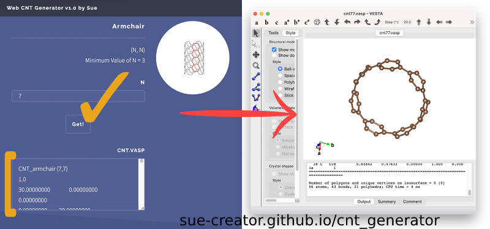

# Carbon Naotubes Generator Online v1.0
### Website

  
<a href="https://sue-creator.github.io/cnt_generator/" target="_blank" rel="noopener noreferrer">Go to the Web Generator🔮</a> 
No one wants to install a program that is only used occasionally and for a short period of time. This generates carbon nanotubes' structures on your web browser right away. No installation is needed! 

- Main Calculation Code: https://github.com/sue-creator/cnt_generator/blob/main/assets/js/util.js

***
Made with

  

